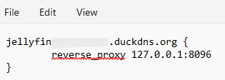
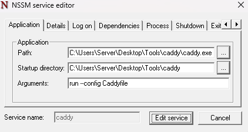

# jellyfin_server_homelab-port-forwarded
Personal documentation :  How my Jellyfin media server is configured.

### Acquiring a sub-domain

* I used duckdns to get a sub-domain that points to my public ip
* I redacted the public ip and domain name for security purpose.

### Port Mapping Configuration

* I have opened port 443 for HTTPS purpose
* I also opened pot 80 for HTTP which, Caddy will handle for ridirection.

### Using Caddy

* I used caddy mainly for auto HTTPS and reverse proxy
* A created configuration file is also stored within the same folder for easy access
* The caddy is setup within the same machine so loopback ip address is used.
  

### Windows Firewall Configuration

* Its just the default so nothing to change in here

### Using NSSM for auto start

* I used NSSM to run the Caddy and Jellyfin as Windows service
* I used this to start the server without manually starting each of them.

### Screenshot of the Server's Dashboard

